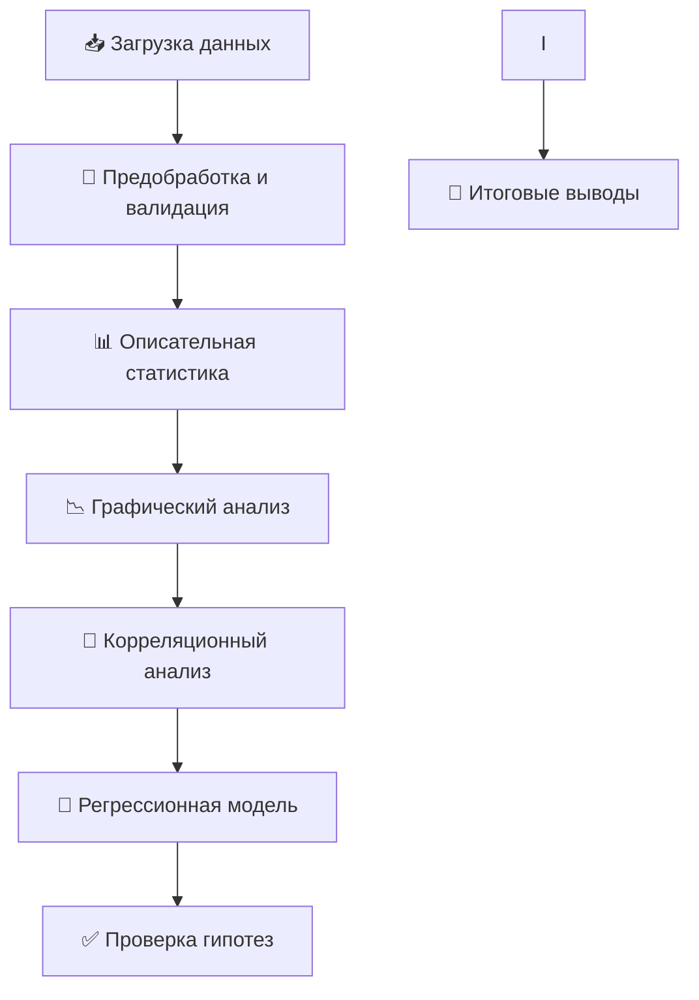
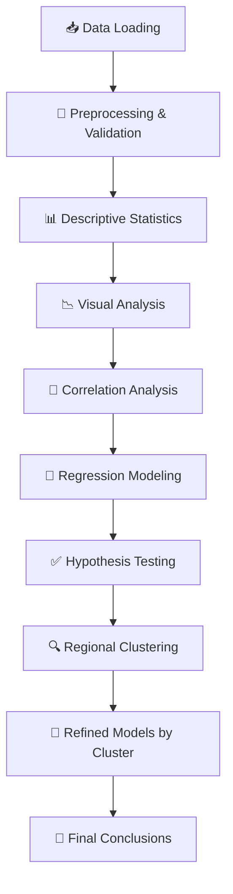

# 📊 README

<!-- Colab Badge - Кнопка для открытия в Google Colab -->
[](https://colab.research.google.com/github/Tomato-angel/iad-life-expectancy-RF-regions-2011/blob/master/notebooks/workflow.ipynb)

---

# [🇷🇺]  Влияние обеспеченности врачами на ожидаемую продолжительность жизни в регионах РФ (2011 г.)

> **Интеллектуальный анализ данных (ИАД)** | Учебный проект

[🇬🇧 English version](#-english-version) • [📊 Данные](#-источники-данных) • [🚀 Быстрый старт](#-быстрый-старт) • [📁 Структура](#-структура-проекта)

---

## 🎯 О проекте

Данный репозиторий содержит исследование влияния обеспеченности врачебными кадрами на ожидаемую продолжительность жизни (ОПЖ) в регионах Российской Федерации за 2011 год.

### 🔍 Цель исследования
Выявить статистическую зависимость между обеспеченностью врачами и ожидаемой продолжительностью жизни для обоснования приоритетов регионального здравоохранения.

### 📋 Задачи
1. Первичный анализ и очистка данных по 83 регионам РФ
2. Расчёт описательных статистик и оценка вариативности показателей
3. Проверка гипотезы о значимости влияния обеспеченности врачами на ОПЖ
4. Построение модели линейной регрессии и оценка её адекватности
5. Кластеризация регионов и построение уточнённых моделей

### 🧪 Проверяемая гипотеза
```
H₀: β₁ = 0  — обеспеченность врачами не влияет на ОПЖ
H₁: β₁ ≠ 0  — существует значимая связь между обеспеченностью врачами и ОПЖ
Уровень значимости: α = 0.05
```

---

## 🚀 Быстрый старт

### ▶️ Вариант 1: Запуск в Google Colab (рекомендуется)
[](https://colab.research.google.com/github/Tomato-angel/iad-life-expectancy-RF-regions-2011/blob/master/notebooks/workflow.ipynb)

1. Нажмите на кнопку **"Open In Colab"** выше
2. Дождитесь загрузки ноутбука
3. Нажмите `Runtime → Run all` для выполнения всех ячеек
4. Результаты и графики сохранятся в вашей сессии

### 💻 Вариант 2: Локальная установка

#### Требования
- Python 3.8+
- Jupyter Notebook / JupyterLab
- Git

#### Установка

```bash
# 1. Клонируйте репозиторий
git clone https://github.com/Tomato-angel/iad-life-expectancy-RF-regions-2011.git
cd iad-life-expectancy-RF-regions-2011

# 2. Создайте виртуальное окружение (рекомендуется)
python -m venv venv
# Для Windows:
venv\Scripts\activate
# Для Linux/Mac:
source venv/bin/activate

# 3. Установите зависимости
pip install -r requirements.txt

# 4. Запустите Jupyter Notebook
jupyter notebook notebooks/workflow.ipynb
```

#### Альтернатива: Использование conda
```bash
conda create -n iad-life python=3.10
conda activate iad-life
pip install -r requirements.txt
jupyter notebook notebooks/workflow.ipynb
```

---

## 📁 Структура проекта

```
📦 iad-life-expectancy-RF-regions-2011
├── 📂 data/                          # Исходные данные
│   └── encodedUTF8_сombining_samples_for_2011.csv
├── 📂 notebooks/                     # Jupyter ноутбуки
│   ├── 📂 figures/                   # Сохранённые графики
│   └── workflow.ipynb                # Основной аналитический ноутбук
├── 📂 src/                           # Исходный код модулей
├── 📂 reports/                       # Отчёты и результаты
├── 📂 links/                         # Ссылки на источники Росстата
├── 📂 assets/                        # Дополнительные ресурсы
├── 📄 requirements.txt               # Зависимости Python
├── 📄 .gitignore                     # Исключаемые файлы
└── 📄 README.md                      # Этот файл
```

---

## 📊 Источники данных

Данные получены из официального сайта **Росстата** (2012 г.):

| Показатель | Ссылка |
|-----------|--------|
| 📈 Регионы России. Соц.-экон. показатели | [Росстат 2012](https://rosstat.gov.ru/bgd/regl/B12_14p/Main.htm) |
| 👶 Ожидаемая продолжительность жизни | [Данные ОПЖ](https://rosstat.gov.ru/bgd/regl/B12_14p/IssWWW.exe/Stg/d01/03-13.htm) |
| 👨‍⚕️ Численность врачей | [Врачи по регионам](https://rosstat.gov.ru/bgd/regl/B12_14p/IssWWW.exe/Stg/d01/07-06.htm) |
| 👥 Численность населения | [Население РФ](https://rosstat.gov.ru/bgd/regl/B12_14p/IssWWW.exe/Stg/d01/03-01.htm) |

---

## 🛠 Используемые технологии

```yaml
Анализ данных:
  - pandas: работа с табличными данными
  - numpy: численные вычисления
  
Визуализация:
  - matplotlib: базовые графики
  - seaborn: статистические визуализации
  
Моделирование:
  - scikit-learn: машинное обучение, кластеризация
  - statsmodels: статистические тесты, регрессия
  - scipy: научные вычисления
  
Среда:
  - Jupyter Notebook: интерактивный анализ
```

---

## 📈 Этапы анализа



---

## 📋 Переменные датасета

| Переменная | Описание | Тип |
|-----------|----------|-----|
| `federal_district` | Федеральный округ | string |
| `region` | Название региона | string |
| `population_k` | Население, тыс. чел. | float |
| `number_of_doctors_k` | Численность врачей, тыс. чел. | float |
| `doctors_per_10k` | **Расчётная**: врачи на 10 тыс. населения | float |
| `life_expectancy_all` | ОПЖ при рождении, всего | float |
| `life_exp` | **Целевая переменная**: ОПЖ для анализа | float |

---

## 🗂 Результаты

После выполнения ноутбука в папке `notebooks/figures/` будут сохранены:
- 📊 Графики распределения переменных
- 📈 Диаграммы рассеяния и регрессионные линии
- 📄 `descriptive_stats.csv` — таблица описательных статистик

---

## 📄 Лицензия

Этот проект создан в учебных целях. Данные предоставлены Росстатом в открытом доступе.

---

## ⭐ Если проект был полезен

Поставьте звезду репозиторию — это поможет другим студентам найти этот материал! 🙏

---

<!-- ============================================ -->
<!-- 🇬🇧 ENGLISH VERSION / АНГЛИЙСКАЯ ВЕРСИЯ      -->
<!-- ============================================ -->
## 🇬🇧 English Version

### Impact of Doctor Availability on Life Expectancy in Russian Regions (2011)

> **Intelligent Data Analysis (IDA)** | Academic Project

[🇷🇺 Русская версия](#-влияние-обеспеченности-врачами-на-ожидаемую-продолжительность-жизни-в-регионах-рф-2011-г) • [📊 Data Sources](#-data-sources) • [🚀 Quick Start](#-quick-start) • [📁 Structure](#-project-structure)

---

### 🎯 Project Overview

This repository contains a research project analyzing the statistical relationship between doctor availability and life expectancy across Russian Federation regions in 2011.

### 🔍 Research Objective
Identify the statistical dependence between medical staff availability and life expectancy to inform regional healthcare policy priorities.

### 📋 Research Tasks
1. Primary data analysis and cleaning for 83 Russian regions
2. Calculate descriptive statistics and assess variable variability
3. Test hypothesis on the significance of doctor availability impact on life expectancy
4. Build linear regression model and evaluate its adequacy

### 🧪 Hypothesis Testing
```
H₀: β₁ = 0  — Doctor availability does not affect life expectancy
H₁: β₁ ≠ 0  — Significant relationship exists between doctor availability and life expectancy
Significance level: α = 0.05
```

---

## 🚀 Quick Start

### ▶️ Option 1: Run in Google Colab (Recommended)
[](https://colab.research.google.com/github/Tomato-angel/iad-life-expectancy-RF-regions-2011/blob/master/notebooks/workflow.ipynb)

1. Click the **"Open In Colab"** button above
2. Wait for the notebook to load
3. Click `Runtime → Run all` to execute all cells
4. Results and plots will be saved in your session

### 💻 Option 2: Local Installation

#### Requirements
- Python 3.8+
- Jupyter Notebook / JupyterLab
- Git

#### Installation Steps

```bash
# 1. Clone the repository
git clone https://github.com/Tomato-angel/iad-life-expectancy-RF-regions-2011.git
cd iad-life-expectancy-RF-regions-2011

# 2. Create virtual environment (recommended)
python -m venv venv
# Windows:
venv\Scripts\activate
# Linux/Mac:
source venv/bin/activate

# 3. Install dependencies
pip install -r requirements.txt

# 4. Launch Jupyter Notebook
jupyter notebook notebooks/workflow.ipynb
```

#### Alternative: Using conda
```bash
conda create -n iad-life python=3.10
conda activate iad-life
pip install -r requirements.txt
jupyter notebook notebooks/workflow.ipynb
```

---

## 📁 Project Structure

```
📦 iad-life-expectancy-RF-regions-2011
├── 📂 data/                          # Raw data files
│   └── encodedUTF8_сombining_samples_for_2011.csv
├── 📂 notebooks/                     # Jupyter notebooks
│   ├── 📂 figures/                   # Generated plots
│   └── workflow.ipynb                # Main analysis notebook
├── 📂 src/                           # Source code modules
├── 📂 reports/                       # Reports and outputs
├── 📂 links/                         # Rosstat source links
├── 📂 assets/                        # Additional resources
├── 📄 requirements.txt               # Python dependencies
├── 📄 .gitignore                     # Git ignore rules
└── 📄 README.md                      # This file
```

---

## 📊 Data Sources

Data obtained from the official **Rosstat** website (2012):

| Indicator | Link |
|-----------|--------|
| 📈 Regions of Russia. Socio-economic indicators | [Rosstat 2012](https://rosstat.gov.ru/bgd/regl/B12_14p/Main.htm) |
| 👶 Life expectancy at birth | [Life Expectancy Data](https://rosstat.gov.ru/bgd/regl/B12_14p/IssWWW.exe/Stg/d01/03-13.htm) |
| 👨‍⚕️ Number of doctors | [Doctors by Region](https://rosstat.gov.ru/bgd/regl/B12_14p/IssWWW.exe/Stg/d01/07-06.htm) |
| 👥 Population size | [Population of RF](https://rosstat.gov.ru/bgd/regl/B12_14p/IssWWW.exe/Stg/d01/03-01.htm) |

---

## 🛠 Technology Stack

```yaml
Data Analysis:
  - pandas: tabular data manipulation
  - numpy: numerical computations
  
Visualization:
  - matplotlib: basic plotting
  - seaborn: statistical visualizations
  
Modeling:
  - scikit-learn: machine learning, clustering
  - statsmodels: statistical tests, regression
  - scipy: scientific computing
  
Environment:
  - Jupyter Notebook: interactive analysis
```

---

## 📈 Analysis Pipeline



---

## 📋 Dataset Variables

| Variable | Description | Type |
|----------|-------------|------|
| `federal_district` | Federal district | string |
| `region` | Region name | string |
| `population_k` | Population, thousands | float |
| `number_of_doctors_k` | Number of doctors, thousands | float |
| `doctors_per_10k` | **Calculated**: doctors per 10k population | float |
| `life_expectancy_all` | Life expectancy at birth, total | float |
| `life_exp` | **Target variable**: life expectancy for analysis | float |

---

## 🗂 Output Files

After running the notebook, the `notebooks/figures/` folder will contain:
- 📊 Distribution plots for key variables
- 📈 Scatter plots with regression lines
- 🗺 Cluster visualization maps
- 📄 `descriptive_stats.csv` — descriptive statistics table

---

## 📄 License

This project was created for educational purposes. Data is provided by Rosstat as open public information.

---

## ⭐ If you found this helpful

Please star the repository — it helps other students discover this resource! 🙏

---

> 💡 **Tip**: Use browser translation or the language links above to switch between Russian and English versions.
```
