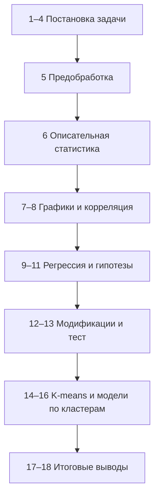

# Влияние обеспеченности врачами на ожидаемую продолжительность жизни в регионах РФ (2011 г.)

[](https://colab.research.google.com/github/Tomato-angel/iad-life-expectancy-RF-regions-2011/blob/master/notebooks/workflow.ipynb)

> **Интеллектуальный анализ данных (ИАД)** | Учебный проект магистратуры НИТУ «МИСИС»

[📊 Данные](#источники-данных) • [🚀 Быстрый старт](#быстрый-старт) • [📁 Структура](#структура-репозитория) • [📈 Результаты](#результаты-исследования)

---

## О проекте

Репозиторий содержит полный цикл интеллектуального анализа данных по **81 субъекту Российской Федерации** (2011 г.): от загрузки и валидации перекрёстных данных Росстата до регрессионного моделирования, кластеризации и оценки прогностических свойств моделей.

### Цель исследования

Выявить статистическую зависимость между обеспеченностью врачебными кадрами (чел. на 10 000 населения) и ожидаемой продолжительностью жизни при рождении для обоснования приоритетов регионального здравоохранения.

### Задачи

1. Первичный анализ и очистка данных по 83 регионам РФ
2. Расчёт описательных статистик и оценка вариативности показателей
3. Проверка гипотезы о значимости влияния обеспеченности врачами на ОПЖ
4. Построение модели линейной регрессии и оценка её адекватности
5. Кластеризация регионов и построение уточнённых моделей

### Проверяемая гипотеза

```
H₀: β₁ = 0  — обеспеченность врачами не влияет на ОПЖ
H₁: β₁ ≠ 0  — существует значимая линейная связь
Уровень значимости: α = 0,05
```

### Ключевой вывод

На межрегиональном уровне в 2011 г. **линейная связь между обеспеченностью врачами и ОПЖ статистически не значима** (r ≈ 0,03, p = 0,77). Существенную долю вариации объясняют масштаб региона и другие социально-экономические факторы; кластеризация выделяет группы регионов с различным уровнем ОПЖ.

---

## Быстрый старт

### Вариант 1: Запуск в Google Colab (рекомендуется)

[](https://colab.research.google.com/github/Tomato-angel/iad-life-expectancy-RF-regions-2011/blob/master/notebooks/workflow.ipynb)

1. Нажмите на кнопку **"Open In Colab"** выше
2. Дождитесь загрузки ноутбука
3. Нажмите `Runtime → Run all` для выполнения всех ячеек
4. Результаты и графики сохранятся в вашей сессии

### Вариант 2: Локальная установка

#### Требования

- Python 3.8+
- Jupyter Notebook / JupyterLab
- Git

#### Установка

```bash

# 1. Клонируйте репозиторий

gitclonehttps://github.com/Tomato-angel/iad-life-expectancy-RF-regions-2011.git

cdiad-life-expectancy-RF-regions-2011


# 2. Создайте виртуальное окружение (рекомендуется)

python-mvenvvenv

# Для Windows:

venv\Scripts\activate

# Для Linux/Mac:

sourcevenv/bin/activate


# 3. Установите зависимости

pipinstall-rrequirements.txt


# 4. Запустите Jupyter Notebook

jupyternotebooknotebooks/workflow.ipynb

```

#### Альтернатива: Использование conda

```bash

condacreate-niad-lifepython=3.10

condaactivateiad-life

pipinstall-rrequirements.txt

jupyternotebooknotebooks/workflow.ipynb

```

---

## Структура репозитория

```
iad-life-expectancy-RF-regions-2011/
├── data/
│   └── encodedUTF8_сombining_samples_for_2011.csv   # Исходные данные Росстата
├── notebooks/
│   ├── workflow.ipynb                              # Основной анализ (18 пунктов ДЗ)
│   └── figures/                                    # Графики и таблицы
├── reports/
│   ├── report_extra_full.docx                      # Отчёт для сдачи (Word)
│   └── report.md                                   # Упрощённый отчёт в Markdown   
├── links/                                          # Ссылки на таблицы Росстата
├── assets/                                         # Логотипы и вспомогательные материалы
├── requirements.txt
├── README.md
└── .venv/                                          # Локальное виртуальное окружение
```

---

## Источники данных

Данные: сборник **«Регионы России. Социально-экономические показатели»** (Росстат, 2012), показатели за **2011 г.**

| Показатель                                             | Ссылка                                                                              |
| ---------------------------------------------------------------- | ----------------------------------------------------------------------------------------- |
| Сборник 2012                                              | [Росстат — главная](https://rosstat.gov.ru/bgd/regl/B12_14p/Main.htm)         |
| Ожидаемая продолжительность жизни | [Таблица 03-13](https://rosstat.gov.ru/bgd/regl/B12_14p/IssWWW.exe/Stg/d01/03-13.htm) |
| Численность врачей                              | [Таблица 07-06](https://rosstat.gov.ru/bgd/regl/B12_14p/IssWWW.exe/Stg/d01/07-06.htm) |
| Численность населения                        | [Таблица 03-01](https://rosstat.gov.ru/bgd/regl/B12_14p/IssWWW.exe/Stg/d01/03-01.htm) |

---

## Переменные датасета

| Переменная    | Описание                                                        |
| ----------------------- | ----------------------------------------------------------------------- |
| `federal_district`    | Федеральный округ                                       |
| `region`              | Субъект РФ                                                     |
| `population_k`        | Население, тыс. чел.                                     |
| `number_of_doctors_k` | Численность врачей, тыс. чел.                    |
| `doctors_per_10k`     | **Расчётная:** врачи на 10 000 населения |
| `life_exp`            | **Целевая:** ОПЖ при рождении, лет        |

---

## Этапы анализа (задания 1–18)



| Часть   | Пункты | Содержание                                                                                   |
| ------------ | ------------ | ------------------------------------------------------------------------------------------------------ |
| Часть 1 | 1–11        | Постановка, EDA, корреляция, OLS, диагностика                           |
| Часть 2 | 12–18       | Полином/лог/множественная регрессия, train/test, K-means, выводы |

---

## Результаты исследования

| Метрика                                    | Значение                            |
| ------------------------------------------------- | ------------------------------------------- |
| Объём выборки                         | 81 регион                             |
| Средняя ОПЖ                             | 68,83 ± 2,42 лет (CV = 3,52%)           |
| Врачи на 10 тыс.                        | 49,33 ± 11,54 (CV = 23,40%)                |
| Корреляция Пирсона r             | 0,033 (p = 0,772)                           |
| R² простой регрессии             | 0,001 (модель неадекватна) |
| R² множественной регрессии | 0,295 (с ln(население))           |
| Оптимальные кластеры K-means   | k = 2, Silhouette ≈ 0,34                   |

Подробные формулы, тесты и интерпретации — в `notebooks/workflow.ipynb` и `reports/report_extra_full.docx`.

---

## Технологии

- **Python 3.10+**, виртуальное окружение `.venv`
- `pandas`, `numpy`, `scipy`, `statsmodels`, `scikit-learn`
- `matplotlib`, `seaborn`
- `jupyter`, `python-docx`

---

## Лицензия и использование

Проект выполнен в учебных целях (дисциплина «Интеллектуальный анализ данных», НИТУ «МИСИС»). Данные Росстата — открытый официальный источник.

---

## English summary

Academic IDA project analyzing the relationship between physician availability and life expectancy across **81 Russian regions** (2011). Includes Jupyter workflow, clustering (K-means), regression diagnostics, and GOST-formatted reports. Open in Colab via the badge above.

<style>#mermaid-1779832051436{font-family:sans-serif;font-size:16px;fill:#333;}#mermaid-1779832051436 .error-icon{fill:#552222;}#mermaid-1779832051436 .error-text{fill:#552222;stroke:#552222;}#mermaid-1779832051436 .edge-thickness-normal{stroke-width:2px;}#mermaid-1779832051436 .edge-thickness-thick{stroke-width:3.5px;}#mermaid-1779832051436 .edge-pattern-solid{stroke-dasharray:0;}#mermaid-1779832051436 .edge-pattern-dashed{stroke-dasharray:3;}#mermaid-1779832051436 .edge-pattern-dotted{stroke-dasharray:2;}#mermaid-1779832051436 .marker{fill:#333333;}#mermaid-1779832051436 .marker.cross{stroke:#333333;}#mermaid-1779832051436 svg{font-family:sans-serif;font-size:16px;}#mermaid-1779832051436 .label{font-family:sans-serif;color:#333;}#mermaid-1779832051436 .label text{fill:#333;}#mermaid-1779832051436 .node rect,#mermaid-1779832051436 .node circle,#mermaid-1779832051436 .node ellipse,#mermaid-1779832051436 .node polygon,#mermaid-1779832051436 .node path{fill:#ECECFF;stroke:#9370DB;stroke-width:1px;}#mermaid-1779832051436 .node .label{text-align:center;}#mermaid-1779832051436 .node.clickable{cursor:pointer;}#mermaid-1779832051436 .arrowheadPath{fill:#333333;}#mermaid-1779832051436 .edgePath .path{stroke:#333333;stroke-width:1.5px;}#mermaid-1779832051436 .flowchart-link{stroke:#333333;fill:none;}#mermaid-1779832051436 .edgeLabel{background-color:#e8e8e8;text-align:center;}#mermaid-1779832051436 .edgeLabel rect{opacity:0.5;background-color:#e8e8e8;fill:#e8e8e8;}#mermaid-1779832051436 .cluster rect{fill:#ffffde;stroke:#aaaa33;stroke-width:1px;}#mermaid-1779832051436 .cluster text{fill:#333;}#mermaid-1779832051436 div.mermaidTooltip{position:absolute;text-align:center;max-width:200px;padding:2px;font-family:sans-serif;font-size:12px;background:hsl(80,100%,96.2745098039%);border:1px solid #aaaa33;border-radius:2px;pointer-events:none;z-index:100;}#mermaid-1779832051436:root{--mermaid-font-family:sans-serif;}#mermaid-1779832051436:root{--mermaid-alt-font-family:sans-serif;}#mermaid-1779832051436 flowchart{fill:apa;}</style>
