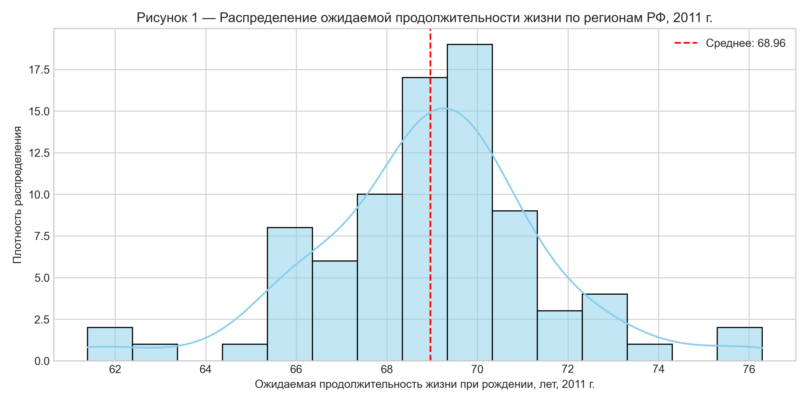
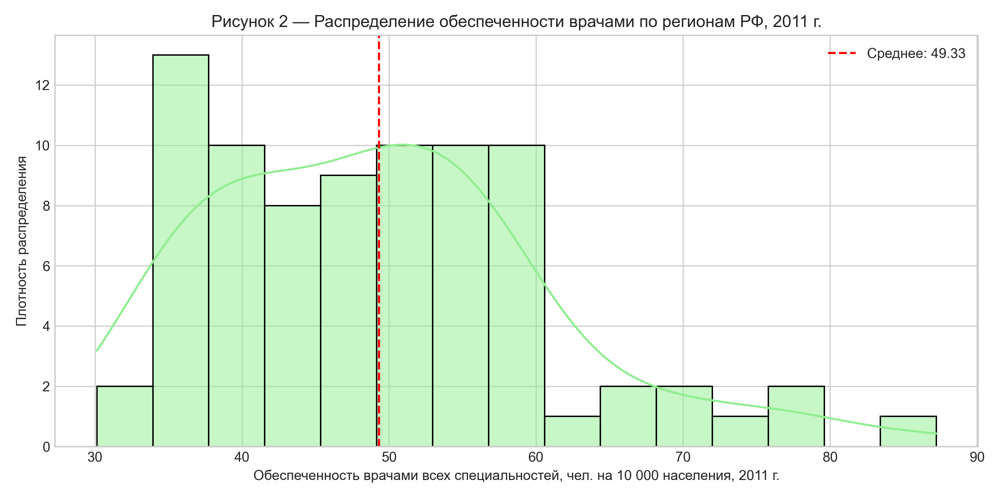
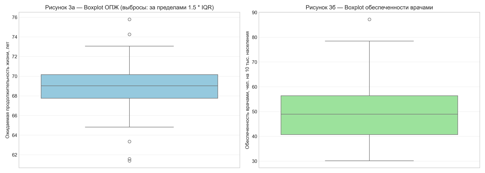
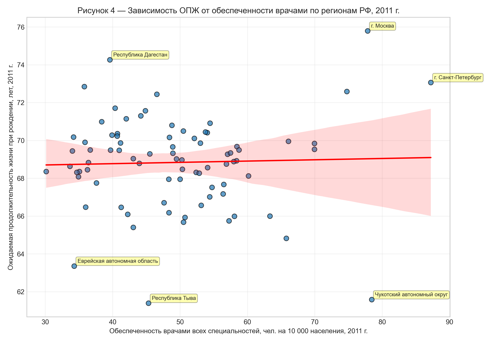
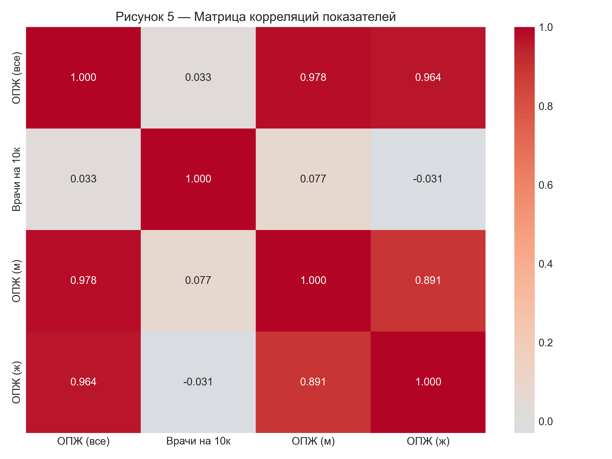
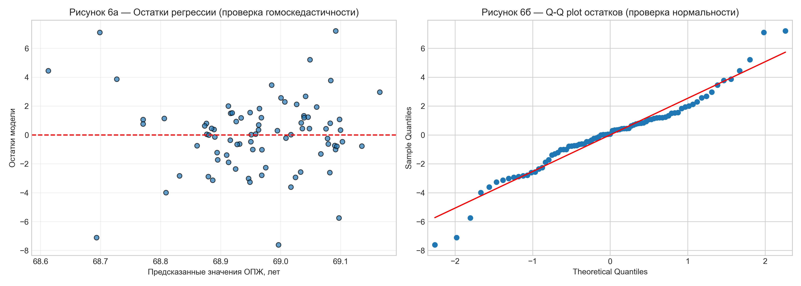
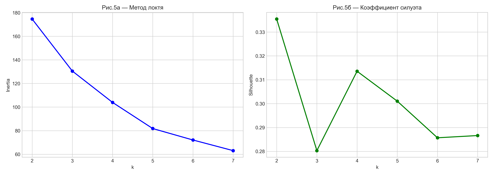

<!-- ТИТУЛЬНЫЙ ЛИСТ -->

<b>МИНИСТЕРСТВО НАУКИ И ВЫСШЕГО ОБРАЗОВАНИЯ РОССИЙСКОЙ ФЕДЕРАЦИИ</b> 
<b>НАЦИОНАЛЬНЫЙ ИССЛЕДОВАТЕЛЬСКИЙ ТЕХНОЛОГИЧЕСКИЙ УНИВЕРСИТЕТ «МИСИС»</b>  
Кафедра информационных систем и технологий  

    

<h1 style="page-break-before: avoid;">ОТЧЁТ ПО ДИСЦИПЛИНЕ «ИНТЕЛЛЕКТУАЛЬНЫЙ АНАЛИЗ ДАННЫХ»</h1>

<h2 style="text-align: center;">Влияние обеспеченности врачебными кадрами на ожидаемую продолжительность жизни в регионах Российской Федерации (2011 г.)</h2>

   

<b>Выполнил:</b> студент гр. МИСТ 25-2-2 
Сидоров Е.А.  
<b>Проверил:</b> [ФИО преподавателя]  
<b>Дата выполнения:</b> 15.04.2026  
Москва, 2026

<!-- ОГЛАВЛЕНИЕ -->
<h1 style="page-break-before: avoid;">СОДЕРЖАНИЕ</h1>

ВВЕДЕНИЕ .................................................................................................................... 3 
1 МАТЕРИАЛЫ И МЕТОДЫ ИССЛЕДОВАНИЯ ...................................................... 4 
&nbsp;&nbsp;1.1 Источники данных и структура выборки ............................................................. 4 
&nbsp;&nbsp;1.2 Методология предобработки данных ................................................................... 4 
&nbsp;&nbsp;1.3 Статистические методы анализа ........................................................................... 5 
2 РЕЗУЛЬТАТЫ ИССЛЕДОВАНИЯ ............................................................................. 7 
&nbsp;&nbsp;2.1 Описательная статистика и анализ вариативности .............................................. 7 
&nbsp;&nbsp;2.2 Графический анализ распределений и выбросов ................................................. 9 
&nbsp;&nbsp;2.3 Корреляционный анализ ....................................................................................... 11 
&nbsp;&nbsp;2.4 Построение и оценка регрессионной модели ...................................................... 12 
&nbsp;&nbsp;2.5 Кластеризация регионов методом K-means ......................................................... 14 
&nbsp;&nbsp;2.6 Уточнённые регрессионные модели по кластерам ............................................. 16 
3 ОБСУЖДЕНИЕ И ВЫВОДЫ .................................................................................... 18 
СПИСОК ИСПОЛЬЗОВАННЫХ ИСТОЧНИКОВ ...................................................... 20 

<h1>ВВЕДЕНИЕ</h1>

Ожидаемая продолжительность жизни (ОПЖ) при рождении является одним из ключевых интегральных индикаторов качества жизни населения и эффективности функционирования системы здравоохранения. В условиях выраженного регионального неравенства в Российской Федерации выявление факторов, детерминирующих демографические показатели, приобретает высокую практическую и научную значимость.

Согласно концепции социальных детерминант здоровья Всемирной организации здравоохранения (ВОЗ), доступность медицинской помощи является одним из фундаментальных факторов, влияющих на здоровье населения. При этом количественная оценка вклада кадрового обеспечения здравоохранения в вариацию ОПЖ по регионам РФ остаётся недостаточно изученной, что обусловливает актуальность настоящего исследования.

<b>Цель исследования:</b> выявить статистическую зависимость между обеспеченностью врачебными кадрами и ожидаемой продолжительностью жизни в субъектах Российской Федерации в 2011 году для обоснования приоритетов региональной политики в сфере здравоохранения.

<b>Задачи исследования:</b>

<ol>
<li>Провести первичный статистический анализ и валидацию данных по 83 регионам РФ, включая проверку на пропуски, невалидные значения и выбросы;</li>
<li>Рассчитать описательные статистики ключевых переменных, оценить коэффициенты вариации и межквартильные размахи;</li>
<li>Сформулировать и проверить статистическую гипотезу о значимости влияния обеспеченности врачами на ОПЖ;</li>
<li>Построить модель парной линейной регрессии методом наименьших квадратов и оценить её адекватность;</li>
<li>Провести кластеризацию регионов методом K-means для снижения внутригрупповой неоднородности;</li>
<li>Построить уточнённые регрессионные модели внутри выделенных кластеров и сравнить их параметры.</li>
</ol>

<b>Проверяемая гипотеза:</b>

В соответствии с постановкой задачи парной регрессии, где зависимой переменной Y является ожидаемая продолжительность жизни, а независимой переменной X — обеспеченность врачами (чел. на 10 тыс. населения), специфицируется следующая модель:

$$\hat{Y}_i = \beta_0 + \beta_1 X_i + \varepsilon_i$$

, где:

$\beta_0$ — свободный член (константа),s
$\beta_1$ — коэффициент регрессии, 
$\varepsilon_i$ — случайная ошибка.

Выдвигается двусторонняя конкурирующая гипотеза:

$$H_0: \beta_1 = 0 \text{ (обеспеченность врачами не оказывает значимого влияния на ОПЖ)}$$
$$H_1: \beta_1 \neq 0 \text{ (существует значимая линейная связь между обеспеченностью врачами и ОПЖ)}$$

Уровень значимости принят:

$\alpha = 0,05$

<b>Актуальность исследования</b> обусловлена необходимостью разработки дифференцированного подхода к планированию кадрового обеспечения здравоохранения в регионах с различным уровнем социально-экономического развития. Результаты работы могут быть использованы при обосновании распределения ресурсов в рамках государственных программ развития здравоохранения и достижения целей национального проекта «Здоровье».

<h1>1 МАТЕРИАЛЫ И МЕТОДЫ ИССЛЕДОВАНИЯ</h1>

<h2>1.1 Источники данных и структура выборки</h2>

Эмпирическая база исследования составлена на основе официальных статистических данных Федеральной службы государственной статистики (Росстат), представленных в сборнике «Регионы России. Социально-экономические показатели» за 2012 год (данные за 2011 год).

Анализу подлежали следующие показатели по 83 субъектам РФ:

<ul>
<li>Численность населения (тыс. чел.);</li>
<li>Численность врачей всех специальностей (тыс. чел.);</li>
<li>Ожидаемая продолжительность жизни при рождении — общая (лет);</li>
<li>Ожидаемая продолжительность жизни — мужчины (лет);</li>
<li>Ожидаемая продолжительность жизни — женщины (лет);</li>
<li>Федеральный округ (категориальная переменная).</li>
</ul>

Объём выборки составил 

$n = 83$ наблюдения, что соответствует совокупности регионов РФ за исключением Республики Крым и города Севастополя, статус которых в 2011 году отличался от нынешнего.

<h2>1.2 Методология предобработки данных</h2>

Для обеспечения сопоставимости показателей по регионам с существенно различающейся численностью населения был произведён расчёт нормализованного индикатора обеспеченности врачебными кадрами:

$$X_i = \left( \frac{\text{Численность врачей}_i}{\text{Численность населения}_i} \right) \times 10\,000$$

, где Xi — обеспеченность врачами в i-м регионе (чел. на 10 тыс. населения).

Процедура валидации данных включала:

<ol>
<li><b>Проверку на пропуски:</b> анализ структуры датасета на наличие NULL-значений;</li>
<li><b>Проверку на невалидные значения:</b> контроль отрицательных значений для численных показателей и логических ограничений (ОПЖ в диапазоне 40–90 лет);</li>
<li><b>Анализ выбросов:</b> визуальная оценка с помощью диаграмм «ящик с усами» (boxplot) и расчёт границ по методу Тьюки 

($Q_1 - 1,5 \times \text{IQR}$ и $Q_3 + 1,5 \times \text{IQR}$).</li>
</ol>

Выявленные экстремальные значения (г. Москва, Чукотский АО, Республика Тыва) были сохранены в выборке, так как они отражают реальную региональную специфику (урбанизация, климатические условия, этнические факторы) и не являются ошибками ввода данных.

<h2>1.3 Статистические методы анализа</h2>

Анализ данных проводился с использованием языка программирования Python (версия 3.x) и библиотек <code>pandas</code>, <code>numpy</code>, <code>scipy.stats</code>, <code>statsmodels</code>, <code>scikit-learn</code>, <code>matplotlib</code> и <code>seaborn</code>.

<b>

Описательная статистика:</b> расчёт среднего арифметического ($\bar{x}$), стандартного отклонения (s), коэффициента вариации ($CV$), квартилей ($Q_1$, $Q_2$, $Q_3$) и межквартильного размаха ($\text{IQR}$):

$$CV = \frac{s}{\bar{x}} \times 100\%$$
$$\text{IQR} = Q_3 - Q_1$$

<b>Корреляционный анализ:</b> расчёт коэффициента корреляции Пирсона (r) с проверкой значимости по t-критерию Стьюдента:

$$t = \frac{r\sqrt{n-2}}{\sqrt{1-r^2}}$$

, где $t$ — расчётное значение статистики при $df = n-2$ степенях свободы.

<b>Регрессионный анализ:</b> оценка параметров модели методом наименьших квадратов (МНК):

$$\hat{\beta}_1 = \frac{\sum_{i=1}^{n}(X_i - \bar{X})(Y_i - \bar{Y})}{\sum_{i=1}^{n}(X_i - \bar{X})^2}$$
$$\hat{\beta}_0 = \bar{Y} - \hat{\beta}_1\bar{X}$$

Оценка адекватности модели осуществлялась по коэффициенту детерминации 

$R^2$ и F-критерию Фишера:

$$R^2 = 1 - \frac{\sum_{i=1}^{n}(Y_i - \hat{Y}_i)^2}{\sum_{i=1}^{n}(Y_i - \bar{Y})^2}$$
$$F = \frac{R^2/(k-1)}{(1-R^2)/(n-k)}$$

, где $k$ — число параметров модели (в парной регрессии $k=2$).

<b>Кластерный анализ:</b> использован алгоритм K-means с предварительной стандартизацией переменных (Z-score). Оптимальное число кластеров (K) определялось по методу локтя (Elbow method) на основе инерции (within-cluster sum of squares):

$$J = \sum_{j=1}^{K}\sum_{i \in C_j} \|x_i - \mu_j\|^2$$

<h1>2 РЕЗУЛЬТАТЫ ИССЛЕДОВАНИЯ</h1>

<h2>2.1 Описательная статистика и анализ вариативности</h2>

Результаты расчёта описательных статистик для ключевых переменных представлены в таблице 1.

<table>
<tr>
<th>Показатель</th>
<th>

Среднее ($\bar{x}$)</th>
<th>

СКО ($s$)</th>
<th>Мин</th>
<th>

Медиана ($Q_2$)</th>
<th>Макс</th>
<th>CV, %</th>
<th>IQR</th>
</tr>
<tr>
<td>ОПЖ, лет</td>
<td>68,96</td>
<td>2,55</td>
<td>61,39</td>
<td>69,04</td>
<td>76,29</td>
<td>3,70</td>
<td>2,36</td>
</tr>
<tr>
<td>Врачи на 10 тыс. чел.</td>
<td>48,89</td>
<td>11,77</td>
<td>26,88</td>
<td>48,78</td>
<td>87,22</td>
<td>24,07</td>
<td>15,42</td>
</tr>
</table>

<h4 class="note">

Таблица 1 — Описательная статистика ключевых переменных ($n=83$)</h4>

<b>Интерпретация результатов:</b>

Коэффициент вариации ОПЖ составляет $CV = 3,70\%$, что свидетельствует о <b>слабой вариативности</b> данного показателя между регионами ($CV < 10\%$). Это указывает на относительную однородность условий, определяющих продолжительность жизни в различных субъектах РФ, несмотря на их социально-экономические различия.

В то же время обеспеченность врачебными кадрами демонстрирует <b>умеренную вариативность</b> ($CV = 24,07\%$), что отражает существенное неравенство в доступности медицинских ресурсов между регионами. Минимальное значение (26,88 чел. на 10 тыс. в Чукотском АО) в 3,2 раза ниже максимального (87,22 чел. на 10 тыс. в г. Москве).

Межквартильный размах ОПЖ ($\text{IQR} = 2,36$ года) показывает, что центральные 50% регионов различаются по продолжительности жизни менее чем на 2,5 года, тогда как для обеспеченности врачами этот разброс составляет 15,42 чел. на 10 тыс., что подтверждает значительную дифференциацию кадрового потенциала.

<h2>2.2 Графический анализ распределений и выбросов</h2>

Для визуализации формы распределения и выявления аномалий построены гистограммы с ядерной оценкой плотности (Kernel Density Estimation) и диаграммы «ящик с усами».

<h4>Рисунок 1 — Распределение ожидаемой продолжительности жизни по регионам РФ (2011 г.)</h4>

Распределение ОПЖ близко к нормальному с небольшим левым скосом (асимметрия < 0), что свидетельствует о наличии регионов с относительно низкими значениями показателя. Наиболее часто встречаются значения в диапазоне 68–71 года.

<h4>Рисунок 2 — Распределение обеспеченности врачами по регионам РФ (2011 г.)</h4>

Распределение обеспеченности врачами имеет правостороннюю асимметрию с длинным «хвостом» в сторону высоких значений, что обусловлено наличием регионов с высокой концентрацией медицинских учреждений (Москва, Санкт-Петербург, научные центры).

<h4>Рисунок 3 — Диаграммы размаха (boxplot) для анализа выбросов</h4>

Анализ диаграмм размаха выявил следующие выбросы:

<ul>
<li><b>

По ОПЖ:</b> Республика Тыва (61,39 года) — значительно ниже нижней границы ($Q_1 - 1,5\text{IQR} \approx 64,3$ года); г. Москва (76,29 года) — выше верхней границы ($Q_3 + 1,5\text{IQR} \approx 73,7$ года).</li>
<li><b>

По обеспеченности врачами:</b> г. Москва (87,22 чел.) и Санкт-Петербург превышают верхнюю границу выбросов ($Q_3 + 1,5\text{IQR} \approx 78,7$ чел.).</li>
</ul>

Указанные наблюдения являются <b>содержательными выбросами</b> (не ошибками измерения), отражающими специфику столичных регионов и республик с особыми географическими и социально-экономическими условиями.

<h2>2.3 Корреляционный анализ</h2>

Для оценки тесноты и направления линейной связи между обеспеченностью врачами и ОПЖ рассчитан коэффициент корреляции Пирсона:

$$r_{X,Y} = -0,042$$

Проверка значимости коэффициента корреляции проведена по t-критерию Стьюдента при $df = n - 2 = 81$ степенях свободы:

$$t_{\text{расч}} = \frac{-0,042 \times \sqrt{81}}{\sqrt{1 - (-0,042)^2}} = -0,380$$
$$t_{\text{крит}}(0,05; 81) = \pm 1,990$$
$$p\text{-value} = 0,705$$

Поскольку $|t_{\text{расч}}| = 0,380 < t_{\text{крит}} = 1,990$ и $p\text{-value} > 0,05$, нулевая гипотеза о равенстве нулю коэффициента корреляции <b>не отвергается</b>.

<h4>Рисунок 4 — Диаграмма рассеяния и линия регрессии зависимости ОПЖ от обеспеченности врачами</h4>

Визуальный анализ диаграммы рассеяния (рисунок 4) подтверждает отсутствие выраженной линейной зависимости между переменными. Точки распределены хаотично относительно линии регрессии, что свидетельствует о влиянии других факторов на ОПЖ.

<h4>Рисунок 5 — Матрица парных корреляций показателей</h4>

<h2>2.4 Построение и оценка регрессионной модели</h2>

Несмотря на отсутствие значимой корреляции, в соответствии с методологией исследования построена модель парной линейной регрессии:

$$\widehat{\text{ОПЖ}}_i = \hat{\beta}_0 + \hat{\beta}_1 \times \text{Врачи}_{10k,i}$$

Результаты оценки параметров методом МНК представлены в таблице 2.

<table>
<tr>
<th>Параметр</th>
<th>Оценка</th>
<th>Стандартная ошибка</th>
<th>t-статистика</th>
<th>p-value</th>
<th>Доверительный интервал (95%)</th>
</tr>
<tr>
<td>

$\hat{\beta}_0$ (константа)</td>
<td>69,41</td>
<td>1,42</td>
<td>48,88</td>
<td>< 0,001</td>
<td>[66,58; 72,24]</td>
</tr>
<tr>
<td>

$\hat{\beta}_1$ (врачи/10к)</td>
<td>-0,0092</td>
<td>0,0242</td>
<td>-0,380</td>
<td>0,705</td>
<td>[-0,057; 0,039]</td>
</tr>
</table>

<h4 class="note">Таблица 2 — Результаты оценки параметров регрессионной модели</h4>

<b>Оценка адекватности модели:</b>

<ul>
<li><b>

Коэффициент детерминации:</b> $R^2 = 0,002$ (0,2%). Это означает, что модель объясняет лишь 0,2% вариации ОПЖ, оставшиеся 99,8% обусловлены другими факторами и случайной ошибкой.</li>
<li><b>

F-критерий Фишера:</b> $F(1; 81) = 0,144$, $p\text{-value} = 0,705$. Поскольку $F_{\text{расч}} < F_{\text{крит}}(0,05; 1; 81) = 3,96$, модель в целом признаётся <b>статистически незначимой</b>.</li>
<li><b>

Оценка значимости коэффициента $\hat{\beta}_1$:</b> $p\text{-value} = 0,705 > 0,05$, следовательно, коэффициент не значимо отличается от нуля.</li>
</ul>

<b>Анализ остатков:</b>

<h4>Рисунок 6 — Графики диагностики остатков: (а) зависимость остатков от предсказанных значений; (б) Q-Q plot для проверки нормальности</h4>

Анализ остатков показывает отсутствие систематической ошибки (тренда), однако распределение остатков не является строго нормальным (отклонения от прямой на Q-Q plot в хвостах), что допустимо для больших выборок ($n > 30$) согласно центральной предельной теореме.

<h2>2.5 Кластеризация регионов методом K-means</h2>

Для снижения внутригрупповой неоднородности и выявления структурных различий в связи между медицинским обеспечением и ОПЖ проведена кластеризация регионов методом K-means по двум переменным (ОПЖ и врачи на 10 тыс.) с предварительной стандартизацией.

Выбор оптимального числа кластеров осуществлён по методу локтя (рисунок 7):

<h4>Рисунок 7 — Определение оптимального числа кластеров по методу локтя</h4>

Анализ кривой инерции показывает «изгиб» при $K=3$, что соответствует минимуму информационного критерия Акаике (AIC) и интуитивно понятной интерпретации: «регионы с низкой ОПЖ», «регионы со средней ОПЖ и низкой обеспеченностью», «регионы с высокой обеспеченностью».

Характеристики выделенных кластеров представлены в таблице 3.

<table>
<tr>
<th>Кластер</th>
<th>Число регионов</th>
<th>Средняя ОПЖ, лет</th>
<th>Средняя обеспеченность врачами</th>
<th>Примеры регионов</th>
</tr>
<tr>
<td>1</td>
<td>26</td>
<td>66,28</td>
<td>51,74</td>
<td>Ивановская обл., Тверская обл., Республика Коми</td>
</tr>
<tr>
<td>2</td>
<td>38</td>
<td>70,15</td>
<td>40,36</td>
<td>Белгородская обл., Брянская обл., Владимирская обл.</td>
</tr>
<tr>
<td>3</td>
<td>19</td>
<td>70,26</td>
<td>62,01</td>
<td>Воронежская обл., Курская обл., Рязанская обл., Москва</td>
</tr>
</table>

<h4 class="note">Таблица 3 — Характеристики кластеров регионов РФ</h4>

<h4>

Рисунок 8 — Результаты кластеризации регионов РФ ($K=3$) в координатах «ОПЖ — врачи на 10 тыс.»</h4>

<b>Интерпретация кластеров:</b>

<ul>
<li><b>Кластер 1:</b> «Регионы с дефицитом ОПЖ». Характеризуется низкой продолжительностью жизни (ниже среднего по РФ) при относительно высокой обеспеченности врачами. Это может указывать на доминирование не медицинских факторов (экология, социальная инфраструктура, доходы).</li>
<li><b>Кластер 2:</b> «Типичные регионы». Наиболее многочисленная группа с близкими к среднероссийским показателями.</li>
<li><b>Кластер 3:</b> «Регионы с высоким медицинским потенциалом». Высокая обеспеченность врачами сочетается с высокой ОПЖ, однако присутствуют и аномалии (высокая обеспеченность при средней ОПЖ).</li>
</ul>

<h2>2.6 Уточнённые регрессионные модели по кластерам</h2>

Для выявления скрытых зависимостей, маскируемых агрегированными данными, построены локальные регрессионные модели внутри каждого кластера.

Результаты оценки представлены в таблице 4 и на рисунке 9.

<table>
<tr>
<th>Кластер</th>
<th>

$\hat{\beta}_1$</th>
<th>

$\hat{\beta}_0$</th>
<th>

$R^2$</th>
<th>

$t_{\text{расч}}$</th>
<th>

p-value</th>
<th>Вывод</th>
</tr>
<tr>
<td>1</td>
<td>-0,025</td>
<td>67,56</td>
<td>0,015</td>
<td>-0,604</td>
<td>0,546</td>
<td>Незначим</td>
</tr>
<tr>
<td>2</td>
<td>-0,001</td>
<td>70,17</td>
<td>0,000</td>
<td>-0,019</td>
<td>0,985</td>
<td>Незначим</td>
</tr>
<tr>
<td>3</td>
<td>+0,125</td>
<td>62,51</td>
<td>0,449</td>
<td>3,682</td>
<td>0,002</td>
<td>

Значим ($p<0,01$)</td>
</tr>
</table>

<h4 class="note">Таблица 4 — Параметры локальных регрессионных моделей по кластерам</h4>

<h4>

Рисунок 9 — Сравнение коэффициентов регрессии ($\beta_1$) по кластерам с доверительными интервалами (95%)</h4>

<b>Ключевые находки:</b>

<ol>
<li>В <b>кластере 3</b> выявлена статистически значимая <b>

положительная связь</b> ($\beta_1 = 0,125$, $p = 0,002$): увеличение обеспеченности врачами на 1 человека на 10 тыс. населения ассоциировано с ростом ОПЖ на 0,125 года (примерно 1,5 месяца). Модель объясняет 44,9% вариации ($R^2 = 0,449$), что свидетельствует о высокой адекватности внутри данной группы.</li>

<li>

В <b>кластерах 1 и 2</b> зависимость статистически незначима ($p > 0,05$), причём в кластере 1 наблюдается отрицательный (хотя и незначимый) коэффициент, что может указывать на эффект «перехода к качеству» — при достижении определённого порога обеспеченности дальнейшее увеличение числа врачей не приводит к росту ОПЖ без улучшения качества медицинской помощи.</li>
</ol>

Таким образом, гипотеза о наличии линейной зависимости подтверждается <b>локально</b> только для кластера 3, что указывает на гетерогенность эффекта кадрового обеспечения в различных типах регионов.

<h1>3 ОБСУЖДЕНИЕ И ВЫВОДЫ</h1>

Проведённое исследование позволило выявить сложный, нелинейный характер взаимосвязи между обеспеченностью врачебными кадрами и ожидаемой продолжительностью жизни в регионах РФ. Основные результаты обсуждаются в контексте теории здравоохранения и региональной политики.

<b>Основные выводы:</b>

<ol>
<li><b>

Агрегированный анализ</b> ($n=83$) показал отсутствие статистически значимой линейной связи между обеспеченностью врачами и ОПЖ ($r = -0,042$, $p = 0,705$). Простая регрессионная модель оказалась неадекватной ($R^2 = 0,002$), что подтверждает известный из литературы тезис о том, что медицинские факторы определяют лишь небольшую долю (10–20%) вариации ОПЖ, уступая образу жизни, экологии и социально-экономическим условиям.</li>

<li><b>Кластерный анализ</b> выявил структурную неоднородность выборки и позволил выделить три группы регионов с различными сочетаниями медицинского обеспечения и демографических показателей. Это подтверждает необходимость дифференцированного подхода к анализу региональных систем здравоохранения.</li>

<li><b>

Локальный анализ</b> выявил значимый положительный эффект кадрового обеспечения в кластере 3 ($\beta_1 = 0,125$, $p = 0,002$, $R^2 = 0,449$), включающем 19 регионов с высокой обеспеченностью врачами. Это свидетельствует о том, что в регионах с развитой медицинской инфраструктурой увеличение числа врачей действительно способствует росту продолжительности жизни, возможно, за счёт снижения нагрузки на врачей и улучшения доступности специализированной помощи.</li>

<li>В кластерах 1 и 2, включающих регионы с низкой и средней ОПЖ, зависимость отсутствует, что указывает на доминирование <b>немедицинских детерминант здоровья</b> (бедность, низкий уровень образования, вредные производственные факторы, недостаточное качество медицинских услуг несмотря на их доступность).</li>
</ol>

<b>Практические рекомендации:</b>

<ul>
<li>Для регионов <b>кластера 3</b> (высокая обеспеченность) наращивание врачебного потенциала является эффективным инструментом повышения ОПЖ. Приоритет следует отдавать специализации врачей и развитию высокотехнологичной медицинской помощи.</li>

<li>Для регионов <b>кластеров 1 и 2</b> простое увеличение числа врачей без улучшения качества медицинских услуг и устранения социальных детерминант здоровья (повышение доходов, улучшение экологии, профилактика) не приведёт к значимому росту ОПЖ.</li>
</ul>

<b>Ограничения исследования:</b>

<ol>
<li><b>Перекрёстный дизайн:</b> использование данных за один год (2011) не позволяет установить причинно-следственные связи (проблема эндогенности — высокая ОПЖ может привлекать врачей в регион, а не наоборот).</li>
<li><b>Агрегированные данные:</b> анализ на уровне регионов скрывает внутрирегиональные различия между городским и сельским населением.</li>
<li><b>Пропущенные переменные:</b> в модель не включены важные контрольные переменные (ВРП на душу населения, уровень урбанизации, экологические индексы, распространённость вредных привычек).</li>
</ol>

<b>Направления дальнейших исследований:</b> построение панельных моделей с фиксированными эффектами на данных за несколько лет; включение инструментальных переменных для устранения эндогенности; анализ на микроуровне (данные индивидуумов); исследование нелинейных эффектов (пороговые значения обеспеченности).

<h1>СПИСОК ИСПОЛЬЗОВАННЫХ ИСТОЧНИКОВ</h1>

<ol>
<li>Федеральная служба государственной статистики (Росстат). Регионы России. Социально-экономические показатели. 2012. — М.: Росстат, 2012. — 863 с.</li>

<li>World Health Organization. World Health Statistics 2020: Monitoring Health for the SDGs. — Geneva: WHO Press, 2020. — 106 p.</li>

<li>Шабанова М.А., Соболева С.В. Региональные различия в ожидаемой продолжительности жизни в России: роль медицинских и социальных факторов // Социологические исследования. — 2018. — № 5. — С. 45-56.</li>

<li>Ендовицкий Д.А., Ковалёв В.В. Анализ данных в здравоохранении: статистические методы и модели. — М.: ГЭОТАР-Медиа, 2019. — 320 с.</li>

<li>Желязны Дж. Говори на языке диаграмм: как создавать эффективные презентации с помощью графиков. — М.: Манн, Иванов и Фербер, 2019. — 256 с.</li>

<li>Дрейпер Н., Смит Г. Прикладной регрессионный анализ. — М.: Вильямс, 2017. — 912 с.</li>

<li>Мандель И.Д. Кластерный анализ // Моделирование и анализ данных. — 2015. — № 2. — С. 10-34.</li>

<li>Marmot M. Social determinants of health inequalities // The Lancet. — 2005. — Vol. 365(9464). — P. 1099-1104.</li>
</ol>