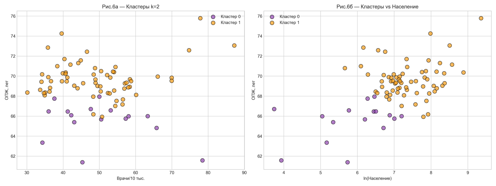
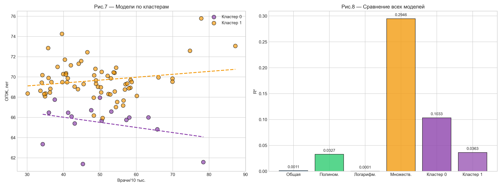

# ОТЧЁТ ПО ДОМАШНЕМУ ЗАДАНИЮ
## Интеллектуальный анализ данных

**Тема:** Влияние обеспеченности врачебными кадрами на ожидаемую продолжительность жизни в регионах РФ (2011 г.)

**Выполнил:** Сидоров Евгений Александрович, группа МИСТ 25-2-2

**Университет:** НИТУ «МИСИС», кафедра МШИБС

**Москва, 2026**

---

## Содержание
- [1. Цель и задачи](#1.-цель-и-задачи)
- [2. Гипотеза](#2.-гипотеза)
- [3. Актуальность](#3.-актуальность)
- [4. План исследования](#4.-план-исследования)
- [5. Валидация данных](#5.-валидация-данных)
- [6. Описательная статистика](#6.-описательная-статистика)
- [7. Графический анализ](#7.-графический-анализ)
- [8. Корреляция](#8.-корреляция)
- [9. Вывод по гипотезам](#9.-вывод-по-гипотезам)
- [10. Регрессия](#10.-регрессия)
- [11. Адекватность модели](#11.-адекватность-модели)
- [12. Модификации](#12.-модификации)
- [13. Тестовая выборка](#13.-тестовая-выборка)
- [14. Кластеризация](#14.-кластеризация)
- [15. Адекватность кластеров](#15.-адекватность-кластеров)
- [16. Регрессия по кластерам](#16.-регрессия-по-кластерам)
- [17. Сравнение моделей](#17.-сравнение-моделей)
- [18. Итоговые выводы](#18.-итоговые-выводы)
- [Список литературы](#список-литературы)

## 1. Цель и задачи исследования {#1-цель-и-задачи}

Выявить статистическую зависимость между обеспеченностью врачами и ОПЖ в регионах РФ (2011) для обоснования приоритетов здравоохранения.

## 2. Проверяемая гипотеза {#2-гипотеза}

H₀: β₁ = 0; H₁: β₁ ≠ 0; α = 0,05. Модель: Y = β₀ + β₁X + ε.

## 3. Актуальность {#3-актуальность}

Региональное неравенство ОПЖ; медицинские факторы объясняют 10–20% вариации (Шабанова, Соболева, 2018).

## 4. План-схема {#4-план}

Загрузка → предобработка → описательная статистика → графики → корреляция → регрессия → кластеризация → выводы.

## 5. Валидация и предобработка {#5-валидация}

n = 81 региона; пропусков нет; рассчитан doctors_per_10k.

## 6. Описательная статистика {#6-описательная}

ОПЖ: 68.83±2.42, CV=3.52%. Врачи: 49.33±11.54, CV=23.40%.

## 7. Графический анализ {#7-графический}

*Рисунок 1 — Гистограмма распределения ожидаемой продолжительности жизни по регионам РФ*

*Рисунок 2 — Гистограмма распределения обеспеченности врачами (чел. на 10 000 населения)*

*Рисунок 3 — Диаграммы «ящик с усами» для ОПЖ и обеспеченности врачами*

*Рисунок 4 — Диаграмма рассеяния и линия простой линейной регрессии*

## 8. Корреляционный анализ {#8-корреляция}

*Рисунок 5 — Тепловая карта матрицы корреляции Пирсона*

r = 0.0327, p = 0.7722, t_расч = 0.290, t_крит = 1.990 → H₀ не отвергается.

## 9. Вывод по гипотезам {#9-вывод}

Линейная связь между X и Y на межрегиональном уровне практически отсутствует.

## 10–11. Регрессия и адекватность {#10-11}

Ŷ = 68.4960 + 0.0069X; R² = 0.0011; β₁: t = 0.290, p = 0.7722; модель неадекватна.

*Рисунок 6 — Диагностика остатков регрессионной модели (остатки и Q-Q plot)*

## 12. Модификация модели {#12-модификация}

Полиномиальная R²=0.0327; логарифмическая R²=0.0001; множественная R²=0.2946, p(F)=0.000001.

## 13. Тестовая выборка {#13-тест}

| Модель | RMSE | MAE | R² | Adj.R² |
|--------|------|-----|-----|--------|
| Линейная | 2.362 | 1.850 | -0.105 | -0.179 |
| Полиномиальная | 2.252 | 1.776 | -0.005 | -0.148 |
| Логарифмическая | 2.364 | 1.851 | -0.108 | -0.182 |
| Множественная | 2.168 | 1.550 | 0.069 | -0.064 |

## 14–15. Кластеризация {#14-15}

*Рисунок 7 — Выбор числа кластеров: метод локтя и коэффициент силуэта*

*Рисунок 8 — Результаты кластеризации K-means (k = 2)*

k=2, Silhouette=0.3355, ANOVA F=70.98, p<0,001.

## 16–17. Модели по кластерам {#16-17}

Кл.0: β₁=-0.0506, p=0.225; Кл.1: β₁=0.0288, p=0.129.

*Рисунок 9 — Сравнение регрессионных моделей и R² по кластерам*

## 18. Итоговые выводы {#18-итог}

Обеспеченность врачами не является значимым линейным предиктором ОПЖ на уровне регионов РФ в 2011 г. Необходим комплексный учёт социально-экономических детерминант и дифференцированная политика по типам регионов.

## Список литературы

1. Росстат. Регионы России. Социально-экономические показатели. 2012.
2. Шабанова М.А., Соболева С.В. Социологические исследования. 2018. № 5.
3. Ендовицкий Д.А., Ковалёв В.В. Анализ данных в здравоохранении. 2019.
4. WHO. World Health Statistics 2020.
5. Draper N.R., Smith H. Applied Regression Analysis. 1998.
6. Желязны Дж. Говори на языке диаграмм. 2019.